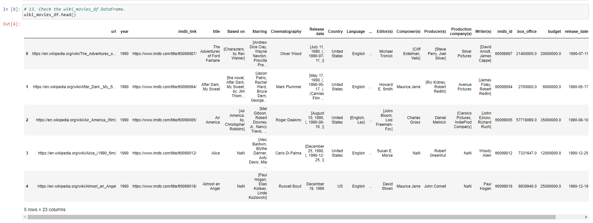
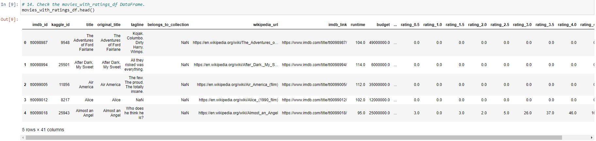
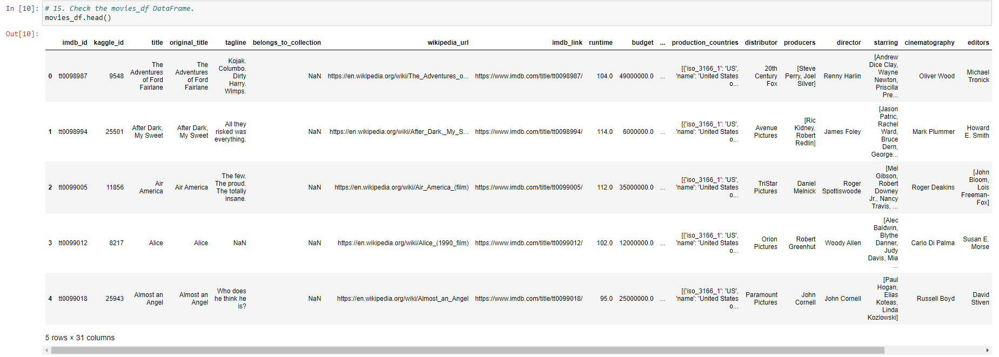
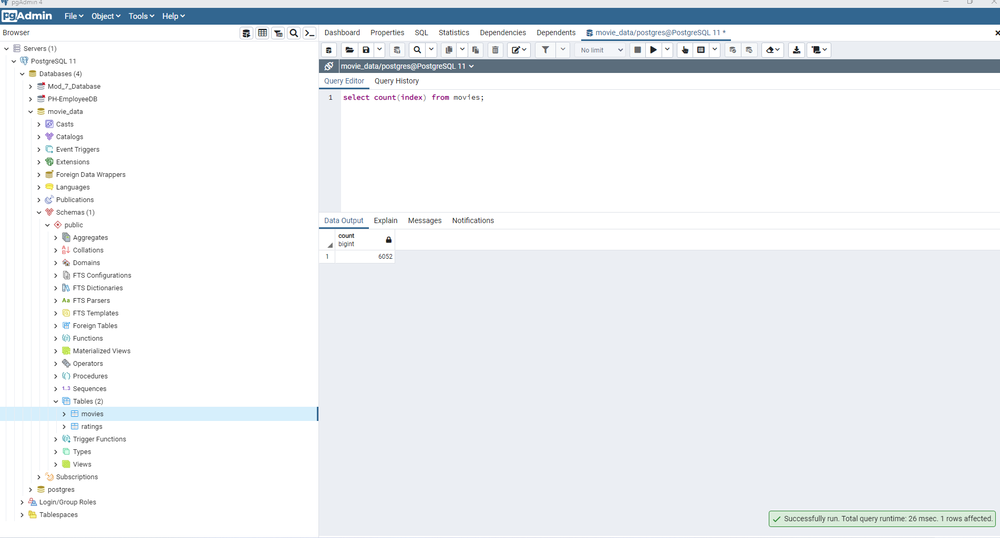
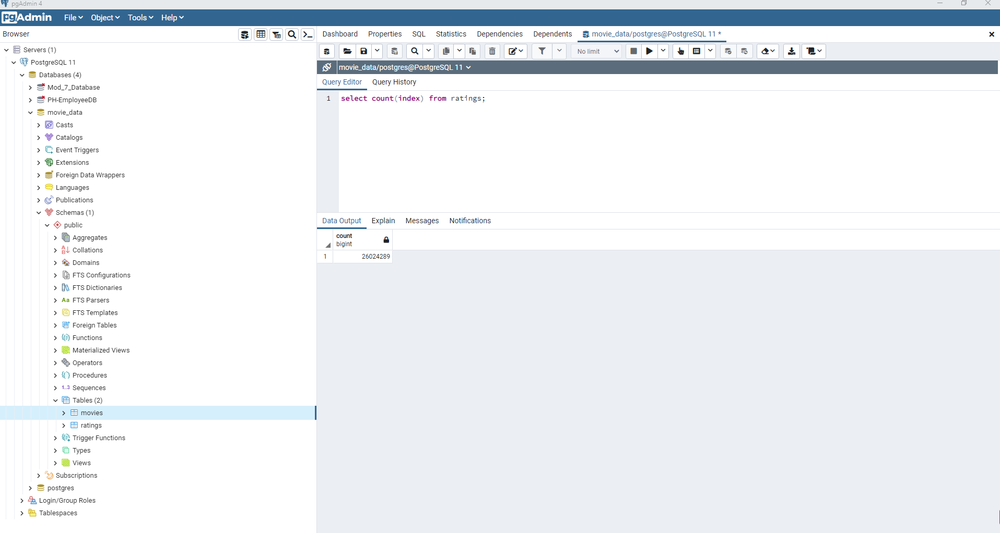

# Overview
The purpose of this challenge was as follows:
- Import three csv files
- Clean the data associated with these files
- Merge the data into two data sets
- Upload the data into a Postgres database
- Perform all of the above functions in one file of code
## Resources
Three data files that were utilized:
- movies_metadata.csv
- ratings.csv
- wikipedia-movies.json

It should be noted that, due tot he size of ratings.csv, it was not uploaded to the GitHub repository so as to not exceed the file size limit. It was therefore added to the .gitignore file.

## Summary
The three files were uploaded, cleaned and transformed to produce the following data sets:

Two tables were created in a Postgres database and populated with the cleaned data as shown below:

